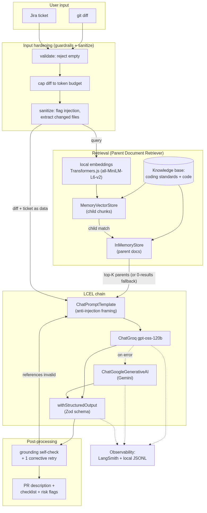

# Technical Design Document
## AI PR / Code Review Assistant — From Prototype to Production-Ready LLM Feature

**Author:** Andres Sandoval · **Course:** GenAI & LangChain for JS Developers (AssureSoft Digital Academy)
**Stack:** TypeScript · LangChain.js · Groq (GPT-OSS) + Google Gemini · Transformers.js · Docker

---

## 1. Problem & Business Value

### 1.1 The bottleneck
On most teams, opening a pull request is a tax on the most expensive people in the building. A developer finishes the actual work, then spends 15–30 minutes writing a description, reconstructing *why* each change was made, and self-reviewing against standards that live in a wiki nobody re-reads. Reviewers then re-derive the same context from scratch. The result is **slow, inconsistent PRs**: thin descriptions, missed standard violations, and review latency that blocks merges.

This is a high-value target because it sits on the critical path of *every* change a team ships, and the cost scales linearly with team size and velocity.

### 1.2 Target user & current workflow
- **Primary user:** the developer authoring a PR; **secondary:** the reviewer.
- **Current workflow:** finish code → manually write PR description → manually skim coding standards → open PR → reviewer reads diff cold → back-and-forth on things a checklist would have caught.

### 1.3 The proposed feature
Given a **git diff** and the **Jira ticket** that motivated it, the assistant produces:
1. a structured **PR description** (summary, changes, testing notes),
2. a **reviewer checklist** tailored to the diff and tied to team standards, and
3. **risk flags** with severity.

Crucially, the output is **grounded** in the team's own coding standards and related code via retrieval — it is not generic advice.

### 1.4 ROI
The blueprint's framing — "why spend $0.05 per call?" — is worth inverting. If a call saved even 10 minutes of senior-engineer time (~$1+ of loaded cost) and improved review quality, $0.05 would be trivially justified. **But this design drives the marginal cost to ~$0** (free Groq tier + local embeddings), so the ROI question collapses entirely: the only cost is engineering time, and the payback is measured in minutes saved per PR across the whole team.

---

## 2. Use-Case Definition

| Dimension | Detail |
|---|---|
| **Trigger** | Developer has a diff + ticket and is about to open a PR |
| **Input** | Unified `git diff`, Jira-style ticket (Markdown) |
| **Output** | PR description + reviewer checklist + risk flags (validated JSON) |
| **Knowledge base** | Team coding standards (6 docs) + a sample of existing code |
| **Success** | Output references only real files, cites relevant standards, catches the obvious risks, and never hallucinates a file path |

---

## 3. System Architecture

The orchestration layer is built with **LCEL (LangChain Expression Language)**. The full data flow follows the required `User → Embedding → Vector Store → LLM → Output Parser` shape, with guardrails on either side:

### 3.1 Components

| Component | Choice | Role |
|---|---|---|
| Embeddings | `HuggingFaceTransformersEmbeddings` (`all-MiniLM-L6-v2`) | Local, in-process, no API key |
| Vector store | `MemoryVectorStore` | Similarity search over child chunks |
| Doc store | `InMemoryStore` | Holds parent documents |
| Retriever | `ParentDocumentRetriever` | **Advanced technique** (see §4.3) |
| Prompt | `ChatPromptTemplate` | Anti-injection framing, strict grounding |
| LLM (primary) | `ChatGroq` — `openai/gpt-oss-120b` | Generation |
| LLM (fallback) | `ChatGoogleGenerativeAI` — `gemini-2.5-flash` | Resilience |
| Output parser | `.withStructuredOutput(zodSchema)` | Validated structured output |
| Observability | LangSmith (env-gated) + local JSONL | Tracing/evidence |

### 3.2 Why LCEL over an agent
An agentic loop with tool-calling is the wrong tool here: the task is a **single, well-defined transformation** (diff + ticket + standards → structured review), not an open-ended goal requiring planning or external actions. LCEL gives a deterministic, traceable, low-latency pipeline with no risk of runaway tool loops. We keep one *bounded* feedback step — the grounding self-check — which is a deterministic guard, not an autonomous agent.

---

## 4. Key Technical Decisions ("the why")

### 4.1 Model choice — Groq GPT-OSS over gpt-4o-mini / Claude
The blueprint asks "why gpt-4o-mini over claude-3.5-sonnet?" The more interesting answer is **why neither hosted commercial model is the primary**:

| Option | Cost (per ~1M tok) | Latency | Notes |
|---|---|---|---|
| **Groq `gpt-oss-120b`** | **$0** (free tier) | **Very low** (LPU) | Open-weight, data stays out of a vendor's training loop |
| OpenAI `gpt-4o-mini` | ~$0.15 in / $0.60 out | Medium | Strong, cheap, but paid + closed |
| Anthropic Claude Sonnet | ~$3 in / $15 out | Medium | Highest quality, ~20–100× the cost |

For a **structured-extraction task** (the model fills a rigid Zod schema from provided context, it does not need frontier reasoning), `gpt-oss-120b` is more than sufficient — the evaluation below shows it producing accurate, grounded reviews. Groq's LPU inference makes it fast, and the free tier makes the per-call cost zero. **And because we built on LangChain, this is a one-line swap** — `LLM_PROVIDER=anthropic` — so the decision is reversible, not load-bearing.

### 4.2 Embeddings — local over hosted
Groq has no embeddings API, which forced a decision that turned into an advantage: **local embeddings via Transformers.js**. `all-MiniLM-L6-v2` runs in-process, needs no key, costs nothing, and keeps proprietary code from ever leaving the container. The weights are baked into the Docker image at build time, so retrieval works fully offline. Trade-off: lower embedding quality than `text-embedding-3-large` — acceptable for a small, well-structured corpus, and upgradeable by swapping one factory line.

### 4.3 Retrieval — Parent Document Retrieval over the alternatives
The required "Pro touch." For **code and standards**, a naive top-k chunk retriever is actively harmful: a 400-char chunk of a function or a standard is precise to *match* but useless as *context*. Parent Document Retrieval resolves this tension — embed **small child chunks** for precise matching, but return the **full parent document** to the LLM.

- *vs. naive RAG:* better context without sacrificing match precision.
- *vs. Self-Querying:* we kept metadata (`category`, `language`) on every doc so self-querying is a natural next step, but it adds an LLM call to parse the query — unjustified at this corpus size.
- *vs. Contextual Compression:* would save tokens, but with a free model and a small corpus the latency/complexity cost outweighs the benefit.

### 4.4 Structured output — `withStructuredOutput` + Zod
The output feeds a UI/automation, so it must be machine-parseable. Binding a Zod schema via `.withStructuredOutput()` collapses the "LLM → Output Parser" stages into one validated step. **Two real portability lessons surfaced during testing** (see §6.3): gpt-oss returns JSON as message *content* rather than a tool call (so we use `method: "jsonSchema"`), and Gemini's `responseSchema` rejects nullable type-unions (so the schema avoids `null`/optional in favor of required fields). The schema is now portable across both providers.

### 4.5 Cross-provider fallback — the point of LangChain
`ChatGroq(...).withFallbacks([ChatGoogleGenerativeAI(...)])` gives a **real, live failover** to a *different vendor*. This is LangChain's core value made concrete: the chain is written once and the vendor is a runtime detail. It is demonstrated live in §6.4, and it doubles as free-tier rate-limit insurance — when Groq returns 429, Gemini transparently answers.

---

## 5. Trade-off Analysis

| Axis | Decision | Trade-off accepted |
|---|---|---|
| **Cost vs. quality** | Free open-weight model | Less raw capability than Claude — fine for structured extraction |
| **Latency vs. accuracy** | Parent Document Retrieval + self-check retry | Self-check can add one extra LLM call when grounding fails |
| **Accuracy vs. context size** | Return full parents | More tokens per call than bare chunks |
| **Simplicity vs. power** | LCEL chain, not an agent | No autonomous tool use (intentionally) |
| **Throughput vs. cost** | Free tier (8k tokens/min) | Calls must be paced; production would use a paid tier or queue |

---

## 6. Evaluation & Iteration

### 6.1 Methodology
A harness (`eval/run-eval.ts`) runs golden + failure cases, an A/B iteration comparison, and the live failover, writing JSONL traces + a Markdown report to `docs/evidence/` and streaming every run to LangSmith. **Final result: all checks passed.**

### 6.2 Edge-case results (from the live run)

| Case | Expectation | Result |
|---|---|---|
| feature-discount-codes | grounded, no hallucinated files | ✅ checklist=9, hallucinated=0, sources cited |
| bugfix-auth-expiry | grounded, cites security/auth standards | ✅ checklist=6, sources=[security-guidelines, authMiddleware, …] |
| empty-diff | rejected with `InputError`, no LLM call | ✅ rejected before any model call |
| prompt-injection | flagged; not compromised | ✅ injection flagged, checklist still produced (6 items) |
| oversized-diff | truncated to budget | ✅ truncated=true |
| zero-retrieval | ungrounded fallback + note | ✅ grounded=false, groundingNote set |

### 6.3 Iteration — fixing a hallucination (the headline result)
The most instructive iteration was the grounding journey, captured by running the **same diff** through v1 and v2:

- **v1 (BEFORE):** a naive prompt with **no retrieval grounding**. The model invented **three file paths that do not exist in the diff**: `src/app.ts`, `src/server.ts`, `tests/orderService.test.ts` — a classic RAG-less hallucination.
- **v2 (AFTER):** **Parent Document Retrieval** + an explicit grounding clause (*"only reference files in the diff"*) + a deterministic **grounding self-check** that re-extracts file references from the output and triggers a corrective retry if any are invented.

| | Hallucinated (out-of-diff) files |
|---|---|
| **BEFORE** (v1, ungrounded) | `src/app.ts`, `src/server.ts`, `tests/orderService.test.ts` (3) |
| **AFTER** (v2, grounded + self-check) | none (0) |

This is the evaluation evidence: `docs/evidence/iteration-before.jsonl` vs `iteration-after.jsonl`, the `iteration-before` / `iteration-after` traces in LangSmith, and the `eval-report.md` summary.

**A second, deterministic iteration** came from output reliability: the first integration attempt returned `OUTPUT_PARSING_FAILURE` because gpt-oss emits JSON as content (not a tool call) and the schema rejected the model's `null`. Switching to `method: "jsonSchema"` and making the schema null-free/portable took parse success from 0% to 100% across **both** Groq and Gemini.

### 6.4 Live cross-provider failover
The harness builds a chain whose Groq primary uses a non-existent model id (guaranteed to 404), wrapped in a Gemini fallback. **Result: the primary failed (confirmed in isolation) and the chain still returned a valid, schema-validated review via Gemini** (`failover` check passed; `docs/evidence/failover.jsonl`). The failover is real, not theoretical.

---

## 7. Production Readiness

- **Monitoring:** LangSmith tracing is provider-agnostic and env-gated (`LANGSMITH_TRACING=true`); every run is labeled (`case-*`, `iteration-before/after`, `failover-groq-to-gemini`). A local JSONL logger guarantees evidence with zero external dependencies, recording provider chain, grounding, retrieval sources, truncation, injection flags, and retries.
- **Security:** untrusted diff/ticket content is structurally framed as data (delimited `<untrusted_*>` blocks + an explicit system instruction), injection attempts are pattern-flagged and surfaced in traces (verified by the injection case), secrets live only in `.env` (gitignored), and embeddings run locally so code never leaves the host.
- **Cost control:** $0 marginal cost today; token caps (`MAX_DIFF_TOKENS`), and a documented path to caching/batching for scale.
- **Rate limits & fallbacks:** the free tier caps ~8k tokens/min; the harness paces calls and the **Gemini fallback absorbs 429s**, alongside the zero-retrieval ungrounded path, empty-input rejection, and bounded retries.
- **Scaling:** swap `MemoryVectorStore` for a persistent store (pgvector/Chroma) with incremental indexing; the retriever interface is unchanged. Run as a stateless container behind a queue for throughput.

---

## 8. Limitations & Future Work
- In-memory vector store re-ingests per run — fine for this corpus, not for a large monorepo.
- Approximate (chars/4) token counting; production would use the model's tokenizer.
- The grounding self-check is heuristic (filename matching); a stronger version would use an LLM-as-judge grounding score.
- Self-Querying and Contextual Compression are designed-for but not enabled (see §4.3).

## 9. Conclusion
This is not "an API call." It is a modular, provider-agnostic RAG pipeline with a real advanced retrieval technique, structured and validated output, layered guardrails, live cross-provider resilience, and observability — packaged to run anywhere Docker runs, at zero marginal cost. The evaluation demonstrates accurate grounded reviews, correct edge-case handling, a measured hallucination fixed (3 → 0 invented files), and a working cross-vendor failover. The design choices are deliberate, defended, and reversible.
